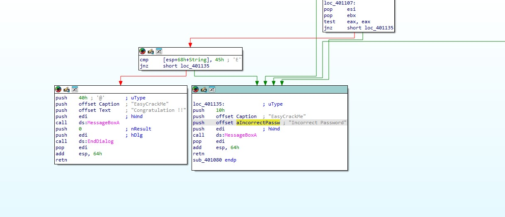
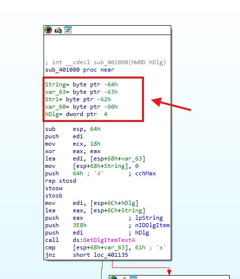
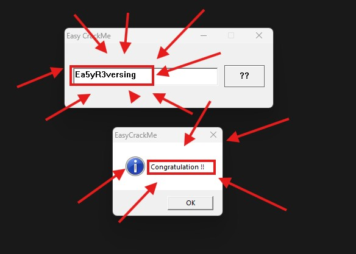

# [Reversing.kr] Thử thách: Easy Crack

## 1. Giới thiệu
- **Mục tiêu:** Tìm mật khẩu chính xác để vượt qua chương trình.
- **Công cụ sử dụng:** IDA Freeware, Windows.

## 2. Phân tích động
Khi chạy file `Easy_CrackMe.exe` và nhập thử mật khẩu sai, chương trình báo lỗi hộp thoại:
> "Incorrect Password"

**Ảnh thông báo lỗi:**


## 3. Phân tích tĩnh bằng IDA (Dịch ngược code)
Mở cửa sổ `Strings` (Shift + F12), tìm kiếm chuỗi báo lỗi và trace ngược (phím X) về hàm kiểm tra chính là `sub_401080`.

Dưới đây là đoạn Assembly kiểm tra chữ cái đầu tiên:

```assembly
cmp     [esp+68h+String], 45h ; So sánh với 'E'
jnz     short loc_401135
```


**Ảnh code:**

**Ảnh biến:**



Chúng ta có thể thứ tự tăng dần nên 

Ghép các điều kiện trên lại, mật khẩu (flag) chính xác là:
**Ea5yR3versing**

**Ảnh flag:**

